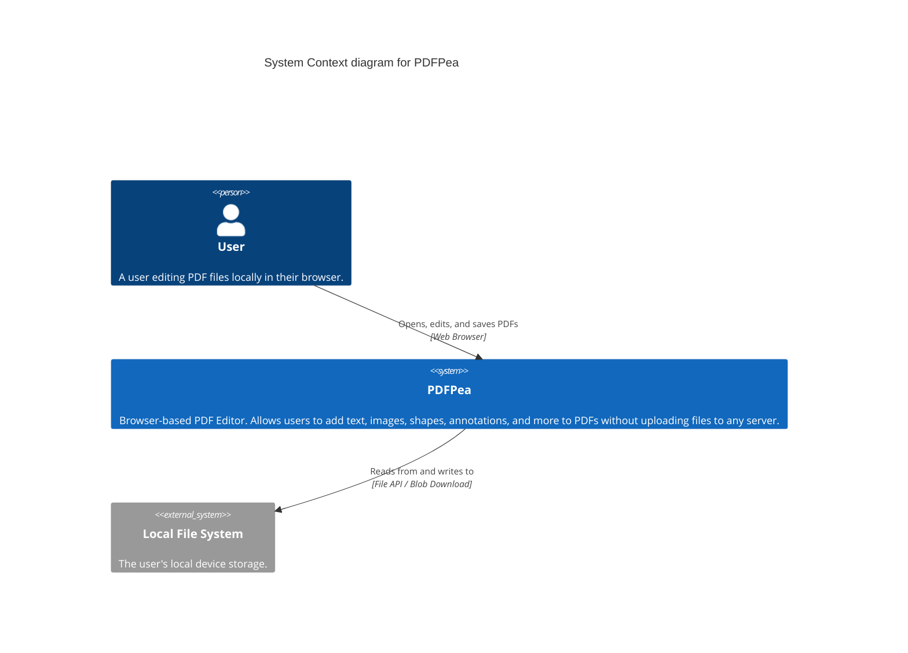
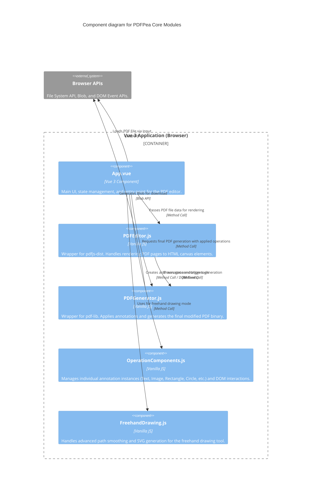

# Architecture Map

## System Context

The System Context diagram illustrates the high-level view of PDFPea, a browser-based PDF editor that operates entirely locally without server interactions for data processing.

## Component Architecture

The Component diagram maps the core modules and data flows within the PDFPea Vue 3 application.

