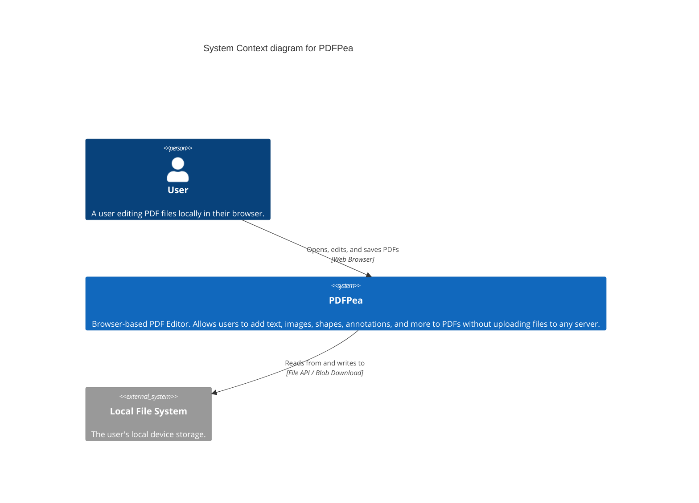
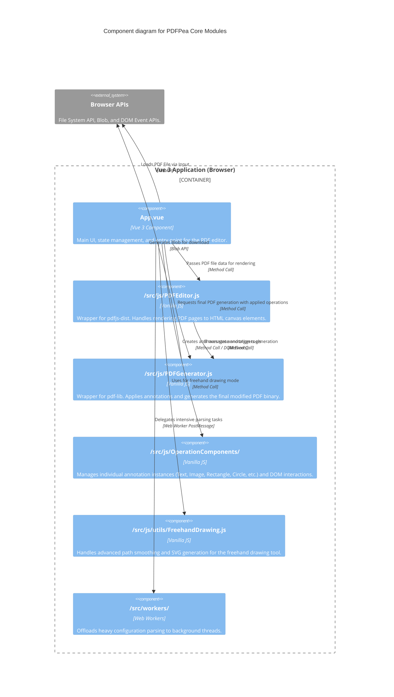

# Architecture Map

## 🏗️ Architectural Map

| Directory                     | Purpose                                                                  |
| ----------------------------- | ------------------------------------------------------------------------ |
| `/.github`                    | GitHub Actions CI/CD workflows and Dependabot configuration.             |
| `/.vscode`                    | VS Code workspace settings and extension recommendations.                |
| `/src`                        | Core Vue 3 application logic, components, styling, and utilities.        |
| `/src/components`             | Reusable UI and tool components.                                         |
| `/src/css`                    | Global styling and tailwind configuration.                               |
| `/src/js`                     | Core Vanilla JavaScript models (e.g. `PDFEditor.js`, `PDFGenerator.js`). |
| `/src/js/OperationComponents` | Manages individual annotation instances.                                 |
| `/src/js/OperationComponents/shapes` | Manages specific shape annotation instances (e.g. Rectangle, Circle). |
| `/src/js/utils`               | Shared utility functions (e.g. `colors.js`, `FreehandDrawing.js`).       |
| `/src/js/utils/canvas`        | HTML5 Canvas specific math and rendering utilities.                      |
| `/src/workers`                | Web Workers for offloading heavy configuration parsing.                  |
| `/public`                     | Static assets like images served directly.                               |
| `/test-files`                 | Local PDF and media assets for testing the editor visually.              |
| `/tests`                      | Playwright end-to-end (E2E) UI and visual regression test suites.        |

## 🔀 Fork Context (vs. Original)

This project is a modernized fork of the original `AlphaCloudTechnologies/pdfpea`. Architecturally, this fork breaks down the original monolithic structures into modular, domain-driven components. The most significant shift is the dismantling of the original `OperationComponents.js` file into a dedicated `/src/js/OperationComponents/` directory containing individual class files (e.g., `TextOperationComponent`, `ImageOperationComponent`) for each tool type, dramatically improving maintainability and reducing module coupling.

## System Context

The System Context diagram illustrates the high-level view of PDFPea, a browser-based PDF editor that operates entirely locally without server interactions for data processing.

```mermaid
C4Context
  title System Context diagram for PDFPea

  Person(user, "User", "A user editing PDF files locally in their browser.")
  System(pdfpea, "PDFPea", "Browser-based PDF Editor. Allows users to add text, images, shapes, annotations, and more to PDFs without uploading files to any server.")
  System_Ext(local_fs, "Local File System", "The user's local device storage.")

  Rel(user, pdfpea, "Opens, edits, and saves PDFs", "Web Browser")
  Rel(pdfpea, local_fs, "Reads from and writes to", "File API / Blob Download")
```

## Component Architecture

The Component diagram maps the core modules and data flows within the PDFPea Vue 3 application.

```mermaid
C4Component
  title Component diagram for PDFPea Core Modules

  Container_Boundary(frontend, "Vue 3 Application (Browser)") {
    Component(app, "App.vue", "Vue 3 Component", "Main UI, state management, and entry point for the PDF editor.")
    Component(pdf_editor, "/src/js/PDFEditor.js", "Vanilla JS", "Wrapper for pdfjs-dist. Handles rendering PDF pages to HTML canvas elements.")
    Component(pdf_generator, "/src/js/PDFGenerator.js", "Vanilla JS", "Wrapper for pdf-lib. Applies annotations and generates the final modified PDF binary.")
    Component(operation_components, "/src/js/OperationComponents/", "Vanilla JS", "Manages individual annotation instances (Text, Image, Rectangle, Circle, etc.) and DOM interactions.")
    Component(freehand_drawing, "/src/js/utils/FreehandDrawing.js", "Vanilla JS", "Handles advanced path smoothing and SVG generation for the freehand drawing tool.")
    Component(workers, "/src/workers/", "Web Workers", "Offloads heavy configuration parsing to background threads.")
  }

  System_Ext(browser_api, "Browser APIs", "File System API, Blob, and DOM Event APIs.")

  Rel(app, pdf_editor, "Passes PDF file data for rendering", "Method Call")
  Rel(app, operation_components, "Creates and manages annotation tools", "Method Call / DOM Events")
  Rel(app, pdf_generator, "Requests final PDF generation with applied operations", "Method Call")
  Rel(app, freehand_drawing, "Uses for freehand drawing mode", "Method Call")
  Rel(app, workers, "Delegates intensive parsing tasks", "Web Worker PostMessage")

  Rel(pdf_editor, pdf_generator, "Shares state and triggers generation", "Method Call")

  Rel(app, browser_api, "Loads PDF File via Input", "File API")
  Rel(pdf_generator, browser_api, "Generates Blob for download", "Blob API")
```
